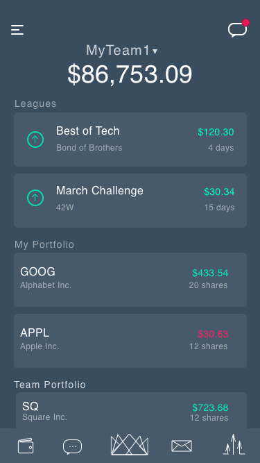
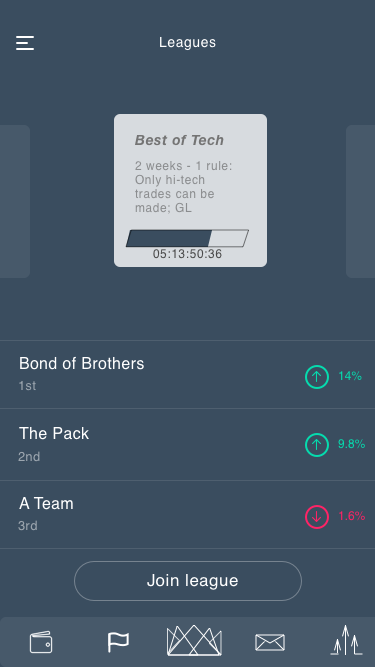
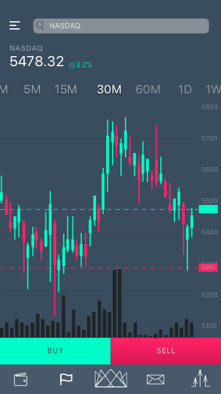
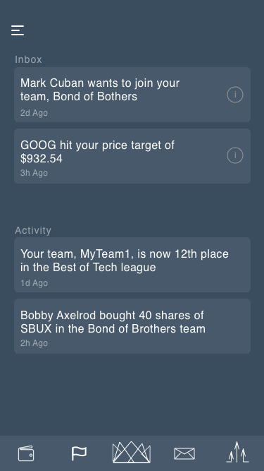
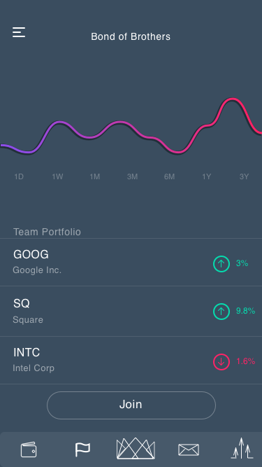
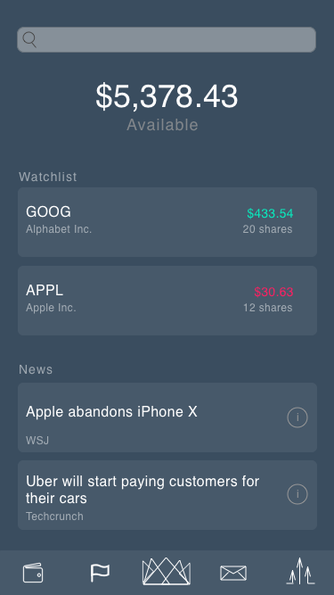
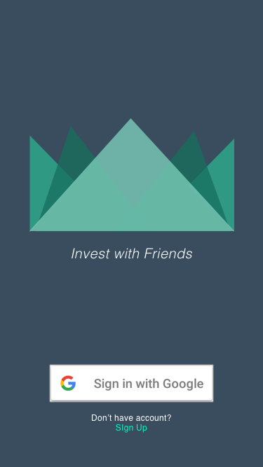
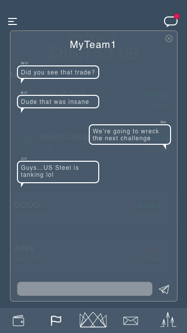
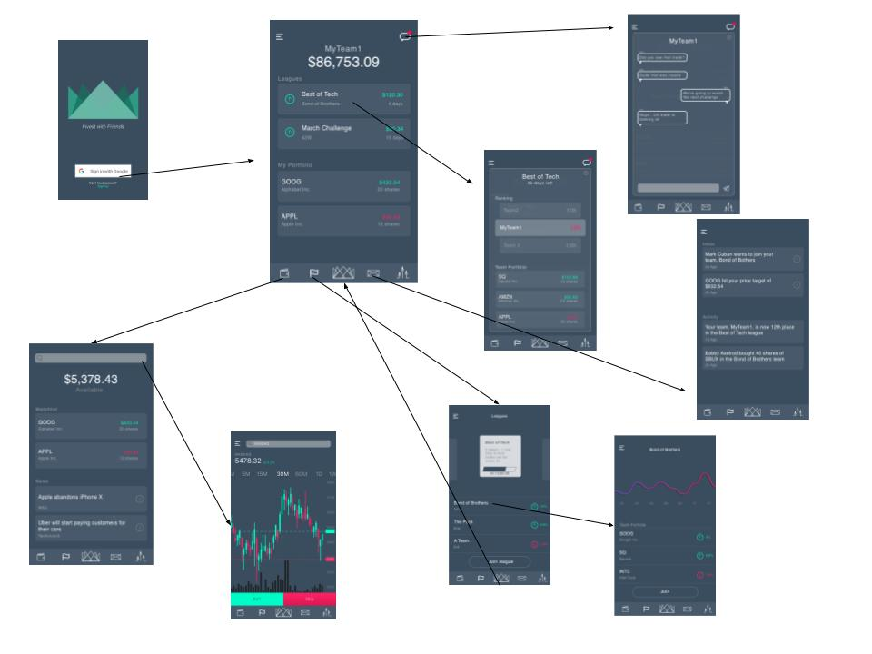

# Hedge
Gamified group investing app, creating a team-based, fantasy football experience for investing in securities. iOS, Swift, Firebase, Alpha Vantage

https://docs.google.com/presentation/d/1gDsSeyaYJe8_AnjCrnIkp2hGGHEYlASjieqUzWML-KI/edit#slide=id.p1

Mission:
------------
To facilitate the creation of mutual funds among millenials and friends to promote financial literacy within the intimidating space of investing.

Technologies:
------------
 - Fabric
 - Firebase Authentication
 - Firebase Realtime Database
 - Firebase Analytics
 - Firebase Functions
 - Firebase Cloud Messaging
 - Firebase Invites
 - Alpha Vantage Security Trading APIs
 - IEX Trading APIs
 - APN - Apple Push Notifications
 - Team Chat - Realtime group messaging
 - MVC Architecture
 - Cocoapods
 - Apple Beta Testing Framework
 - Beta Tested with Fabric
 - Fabric User tracking, usage tracking, and advanced mobile analytics
 - Git version control team workflow

Team:
------------
Adam Moffitt, Hunter Hurja, Jordan Coppert

Preparation:
------------
1. Install Xcode 9
2. Clone or download repository
3. Install CocoaPods (explained here: https://guides.cocoapods.org/using/getting-started.html)
4. In Terminal and within the cloned repository, run the command "pod install" to install the necessary dependencies

Build and Run:
--------------
1. Open fundu.xcworkspace
2. Choose your desired device to build on, I recommend iPhone 11
3. Select the 'Build' button within Xcode to build the project. This will take a few minutes, but a simulator window will display the application on the device chosen in step 2
5. Enjoy!

Screenshots:
--------------

Users create and join different Leagues.  

Search and purchase securities (actual stock purchase functionality not completed, purchases are virtual only).  

Users recieve notifications (APNs) for new messages, important notifications, stock updates etc.  

Track your team's aggregated stock success.  

View your available funds and portfolio value as well as check news updates and stock watchlist (similar to Robinhood wallet page).   

Authentication through Google.   

Team Chat functionality.   

App Wireframe.  

